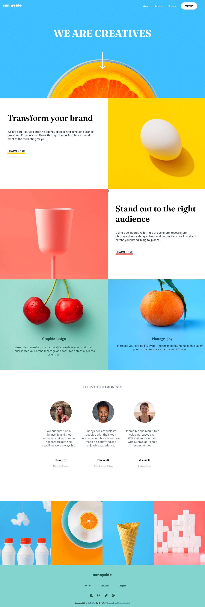

# Frontend Mentor - Sunnyside agency landing page solution

This is a solution to the [Sunnyside agency landing page challenge on Frontend Mentor](https://www.frontendmentor.io/challenges/sunnyside-agency-landing-page-7yVs3B6ef). Frontend Mentor challenges help you improve your coding skills by building realistic projects.

## Table of contents

- [Overview](#overview)
  - [The challenge](#the-challenge)
  - [Screenshot](#screenshot)
- [My process](#my-process)
  - [Built with](#built-w)
  - [What I learned](#what-i-learned)
  - [Continued development](#continued-development)
  - [Useful resources](#useful-resources)
- [Author](#Onkemetse Bogadi Bridgette Koikoi)


**Note: Delete this note and update the table of contents based on what sections you keep.**

## Overview

### The challenge

Users should be able to:

- View the optimal layout for the site depending on their device's screen size
- See hover states for all interactive elements on the page

### Screenshot



## My process

### Built with

- Semantic HTML5 markup
- CSS custom properties
- Flexbox
- CSS Grid
- Javascript variables and arrays

### What I learned

I learned that you can use "overflow-x: hidden" to make the background image appear under the navigation bar instead of it leaving a white space at the top.

The second thing I learned is that grid works better for creating the section of the web-page with columns instead of grid.

See code below:

```css
.container-boxes{
    display: grid;
    grid-template-columns: 1fr 1fr;
    overflow: hidden;
}

.box1{
    height: 500PX;
    justify-content: center;
    text-align: left;
    padding: 50px;
}
.box2{
    object-fit: cover;
    height: 500PX;
}
```

The third thing I learnt is that you can use the mask property to change the background colour of an SVG image because using the color property does not work.

The fourth lesson involves the socal media icons at the bottom of the page, it was difficult to change the color to white when a user hovers, the mask property was not working. After watching a YouTube video I learnt that you can open the image with a text editor and change its fill property to current color, copy the svg to my HTML and then change the color of the logo using fill in CSS.


If you want more help with writing markdown, we'd recommend checking out [The Markdown Guide](https://www.markdownguide.org/) to learn more.

### Continued development

I would like to improve my JavaScript, as such I plan on using the other projects which were provided as learning
material to improve my skills.

I also failed to create the desired underline under the words learn more, I tried the before and after pseudo elements but the did not work. I tried border-bottom but it also did not work.


### Useful resources

- [The Wheel Chair Guy](YouTube video about using grid to dispay two colums) - This helped me to display the section with pictures and text in columns, the solution was easy to follow and worked better than using flex.
- [Enrique Moya-"How to change SVG color in CSS"](YouTube video) - This video helped me turning the logos white when hovering because it showed how to overide the color of an svg .


## Author

- Website - [Onkemetse Bogadi Bridgette Koikoi]


